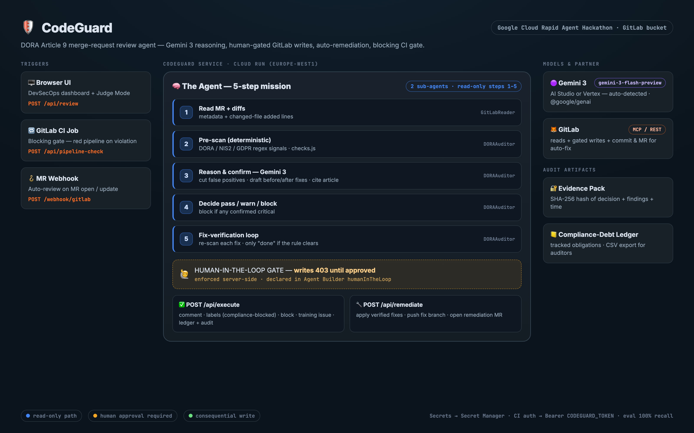

# Architecture — CodeGuard



## 1. The problem
Under the EU **Digital Operational Resilience Act (DORA) Article 9**, financial entities must protect
ICT systems — encryption of data at rest, structured security logging, authorization before data
access, audit trails on writes, and safe error handling. Today a senior engineer reviews each merge
request for this by hand (~23 min/MR), inconsistently, and *after* the code is already written.
CodeGuard moves that check **left** — onto every MR, automatically, in ~45 seconds, with a human
in control of any consequential action.

## 2. System overview

```
                         ┌─────────────────────────────────────────────────────────┐
   Browser UI            │                      CodeGuard service                    │
   (public/index.html)   │                       (Cloud Run)                          │
        │  POST /api/review                                                            │
        ├────────────────►  server.js ──► agent.review()                              │
        │                      │            1. GitLabReader  ── GitLab REST/MCP ──► GitLab
        │                      │            2. pre-scan       ── checks.js (regex rules)
        │                      │            3. Gemini 3       ── @google/genai ──► Gemini
        │                      │            4. decide pass/warn/block
        │                      │            5. fix-verify     ── checks.verifyFix()
        │  ◄─── decision + findings + evidence + proposedActions ──────────────────────
        │
        │  POST /api/execute   (approved=true)        ┌── postNote / setLabels / createIssue
        ├────────────────────────────────────────────┤   recordObligations / recordAudit
        │  POST /api/remediate (approved=true)        └── getFileContent → commitActions → createMR
        │
   GitLab CI  ── POST /api/pipeline-check (Bearer token) ──► review() → {passed:false} → exit 1 (red)
   GitLab MR webhook ── POST /webhook/gitlab ──► review() (read-only, async)
```

## 3. The agent loop (`src/agent.js → review()`)
A multi-step mission, not a single prompt — this is what makes it an *agent*:

| Step | Actor | Action | Source |
|---|---|---|---|
| 1 | **GitLabReader** | Fetch MR metadata + changed-file diffs (added lines only) | `gitlab.js` (REST) / GitLab MCP (judged agent) |
| 2 | **DORAAuditor** | Deterministic pre-scan for DORA/NIS2/GDPR signals | `checks.js → scanDiff()` |
| 3 | **DORAAuditor** | Gemini 3 confirms real violations, cuts false positives, drafts before/after fixes + review comment | `@google/genai`, strict-JSON response |
| 4 | **DORAAuditor** | Decide `pass | warn | block` (block if any confirmed critical) | `agent.js` |
| 5 | **DORAAuditor** | **Fix-verification**: re-scan each proposed fix; only "done" if the rule clears | `checks.js → verifyFix()` |

Output: `{ decision, findings[], evidence{sha256}, obligations[], proposedActions, steps[], elapsed_ms }`.
Steps 1–5 are **read-only**.

## 4. Human-in-the-loop gate
Consequential writes never happen autonomously:
- **Server-enforced:** `POST /api/execute` returns **403** unless `approved: true`.
- **Agent-declared:** `agent-builder/agent.json → humanInTheLoop.requireApprovalFor` lists the GitLab
  write tools, so the judged Agent Builder agent pauses for the same approval.
- **UI:** the ApprovalBar surfaces the proposed actions; the human clicks *Approve & Execute* or *Approve Auto-Fix MR*.

## 5. Consequential actions (post-approval)
| Endpoint | Effect |
|---|---|
| `POST /api/execute` | `create_merge_request_note` (review comment), `add_labels` (`compliance-blocked`, `dora-review`), training issue on repeat offenders, ledger + audit-log insert |
| `POST /api/remediate` | reads each changed file, applies verified `fix_before → fix_after`, commits a `codeguard/fix-mr-*` branch, opens a **remediation MR** into the source branch |

## 6. Three integration surfaces
1. **Hosted web app** — the dashboard + Judge Mode (`public/index.html`).
2. **Blocking CI gate** — `.gitlab-ci.yml` calls `/api/pipeline-check` with a bearer token; a `block` decision exits non-zero → **red pipeline**, merge prevented.
3. **MR webhook** — `/webhook/gitlab` auto-runs a read-only review when an MR opens/updates.

## 7. Differentiators
- **Fix-verification loop** — proposed fixes are re-scanned, so the agent never claims a fix it can't prove.
- **Tamper-evident evidence pack** — `buildEvidence()` SHA-256-hashes the decision + findings + timestamp → a verifiable DORA audit artifact.
- **Compliance-debt ledger** — confirmed violations become tracked obligations (`recordObligations`), exportable to CSV (`/api/obligations/:companyId?format=csv`).
- **Auto-remediation** — closes the loop from *detect* to *fix*.

## 8. Gemini backend abstraction
`agent.js` auto-detects the backend so the same code runs on either:
- **AI Studio / Gemini Developer API** — `GEMINI_API_KEY` set (best for `gen-lang-client` projects).
- **Vertex AI** — `GOOGLE_GENAI_USE_VERTEXAI=true` + ADC (project/location).

`/health` reports the active path. Model: `gemini-3-flash-preview`.

## 9. Data & trust boundaries
- **Secrets** live in Google **Secret Manager**, injected into Cloud Run at deploy (`GEMINI_API_KEY`, `GITLAB_TOKEN`, `CODEGUARD_TOKEN`) — never in source or `.env.example`.
- **CI auth**: `/api/pipeline-check` requires `Authorization: Bearer $CODEGUARD_TOKEN`.
- **No diff retention**: the service reasons over the diff in-request; the only persisted artifacts are the obligation ledger + audit log.

## 10. Tech choices & trade-offs
| Choice | Why | Trade-off |
|---|---|---|
| Regex pre-scan **+** LLM confirm | Cheap deterministic recall; LLM kills false positives | Regex tuned per language; LLM adds ~8s latency |
| `gemini-3-flash-preview` | Fast (supports ~45s claim), genuine Gemini 3, returns clean JSON | `pro` would reason deeper but is slower/deprecated id |
| In-memory ledger | Zero-infra for the demo; works in every mode | Swap for Firestore/Postgres for production durability |
| Single-file UI | No build step, instant deploy, easy to audit | Not componentized for a large team |
