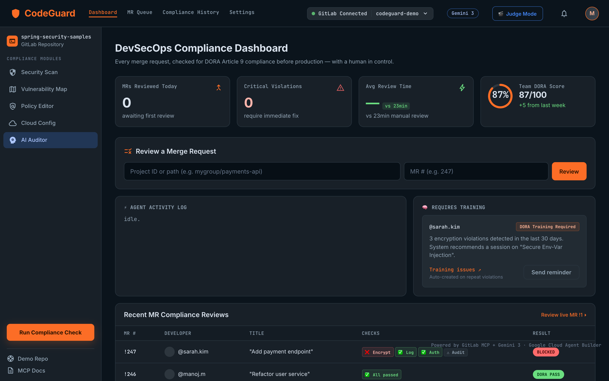
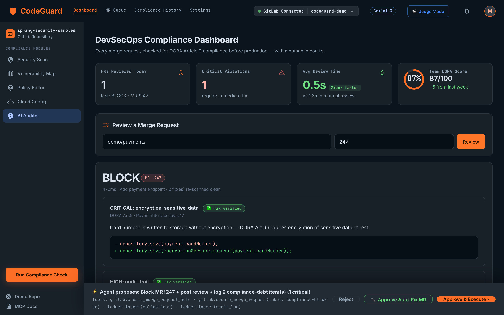
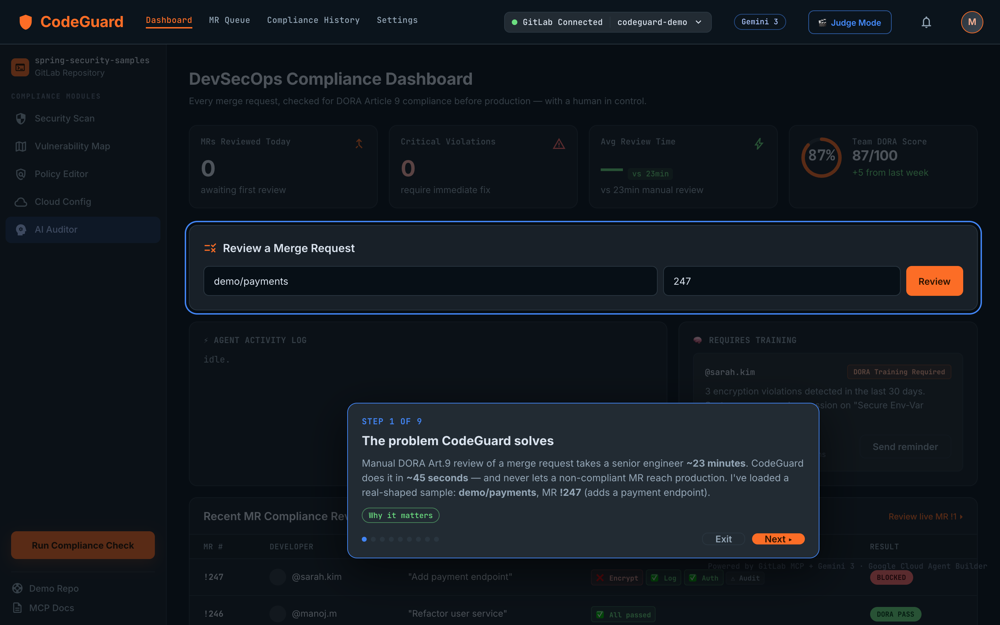
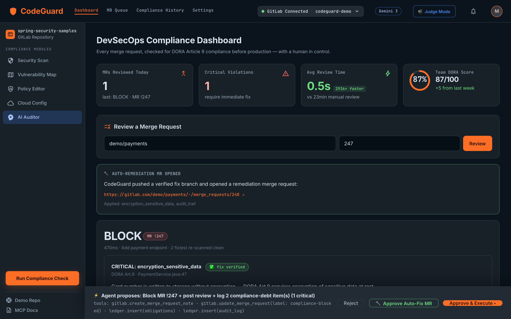
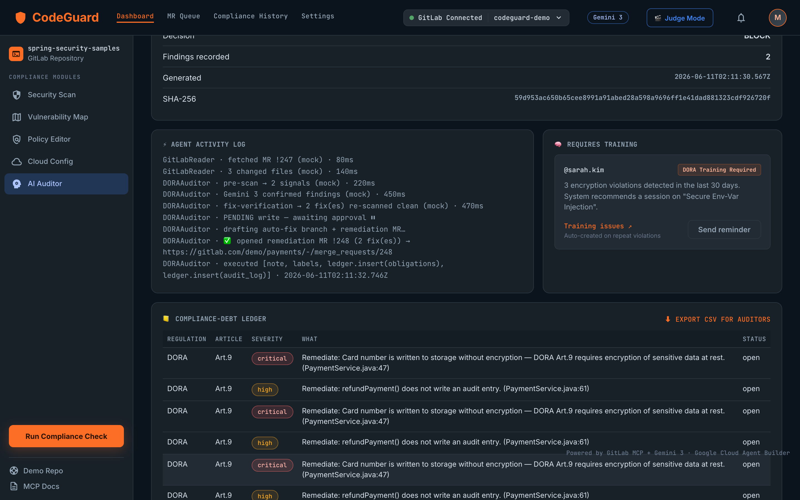

<div align="center">

# 🛡️ CodeGuard

### DORA Article 9 Merge-Request Review Agent — *for financial-services code, before production*

[](https://codeguard-908307939543.europe-west1.run.app)
[](https://ai.google.dev/)
[](https://gitlab.com)


**Every merge request, checked for DORA Art.9 compliance — encryption · structured logging · authorization · audit trail · safe error handling — with a human in control. ~45 seconds vs ~23 minutes of manual review.**

[**🚀 Live App**](https://codeguard-908307939543.europe-west1.run.app) · [Demo MR](https://gitlab.com/mmallick1990/codeguard-demo/-/merge_requests/1) · [Architecture](ARCHITECTURE.md) · [Design System](DESIGN_SYSTEM.md) · [Pitch Deck](DECK.md) · [Demo Script](DEMO.md)

</div>

---

## About

CodeGuard is an autonomous, human-gated compliance reviewer for GitLab merge requests. It reads
the diff, **reasons over it with Gemini 3**, confirms real DORA/GDPR/NIS2 violations (cutting
false positives), drafts a verified fix, and — **only with your approval** — comments, labels,
blocks the MR, opens a training issue, and can **push a remediation MR**. It runs as a hosted web
app, a **blocking CI gate**, and an MR webhook. Built for the **Google Cloud Rapid Agent Hackathon
(GitLab bucket)**.

> **GitHub About (paste into repo settings):**
> *DORA Art.9 compliance agent for GitLab MRs — Gemini 3 reasoning, human-gated GitLab writes, auto-remediation, and a blocking CI gate. Google Cloud Agent Builder + Cloud Run.*

## ✨ What makes it more than an AI linter

| Capability | What it does |
|---|---|
| 🧠 **Gemini 3 reasoning** | Confirms real violations, cuts false positives, drafts before/after fixes with article citations |
| ✅ **Fix-verification loop** | Every proposed fix is re-scanned by the rule engine — only shown if it clears the rule |
| 🙋 **Human-in-the-loop** | Consequential GitLab writes are blocked server-side until a human approves |
| 🔧 **Auto-remediation MR** | The agent doesn't just flag — it pushes a verified fix branch and opens a remediation MR |
| 🔁 **Blocking CI gate** | Wired into `.gitlab-ci.yml`: a non-compliant MR turns the pipeline **red** automatically |
| 🔐 **Tamper-evident evidence** | Each scan emits a SHA-256-hashed evidence record — an audit trail an examiner can verify |
| 📒 **Compliance-debt ledger** | Confirmed violations become tracked obligations, exportable to CSV for auditors |
| 🎬 **Judge Mode** | A self-driving guided tour — runs the whole story with zero credentials |

## 🧱 Stack

| Layer | Tech |
|---|---|
| Reasoning | **Gemini 3** (`gemini-3-flash-preview`, AI Studio **or** Vertex — auto-detected) |
| Agent orchestration | **Google Cloud Agent Builder** (`agent-builder/agent.json`) |
| Partner | **GitLab via GitLab MCP** (judged agent) / REST mirror (hosted app) |
| Backend | Node ≥20 · Express |
| Hosting | **Cloud Run** (europe-west1) |
| Eval | Deterministic golden set — `npm run eval` → 100% recall / 100% fix-verification |

## 🖼️ Gallery

> Auto-generated into [`docs/screenshots/`](docs/screenshots/) — regenerate with `node docs/shoot.mjs`. See the [screenshot guide](docs/SCREENSHOTS.md).

| Dashboard | Live review → BLOCK | 🎬 Judge Mode |
|---|---|---|
|  |  |  |
| **Human approval gate** | **Auto-remediation MR** | **Evidence + ledger** |
|  |  |  |

> 📸 **Add a screenshot of your live red CI pipeline** (logged into GitLab) per the [guide](docs/SCREENSHOTS.md) — it's the strongest "shift-left" proof.

## 🏗️ Architecture


```
Browser (public/index.html)  ──POST /api/review─────►  agent (src/agent.js)
GitLab MR webhook            ──/webhook/gitlab───────►   1. read MR + diffs   → GitLab MCP
GitLab CI job                ──/api/pipeline-check──►    2. pre-scan          → checks.js (DORA rules)
                                                         3. reason/confirm    → Gemini 3 (fix + comment)
                                                         4. decide pass/warn/block
                                                         5. PROPOSE writes ──┐ (gated)
ApprovalBar (human approves) ──POST /api/execute────►   GitLab note + label + block + training issue
                             ──POST /api/remediate──►   push fix branch + open remediation MR
```

Full detail in [ARCHITECTURE.md](ARCHITECTURE.md). The **judged** agent is
[`agent-builder/agent.json`](agent-builder/agent.json) (Gemini 3 + GitLab MCP, writes require
approval); the Express app mirrors it and adds the CI gate + webhook + auto-remediation.

### Two agents
- **GitLabReader** — fetches MR metadata + changed-file diffs.
- **DORAAuditor** — pre-scans with `checks.js`, confirms with Gemini 3, drafts fixes, decides, proposes writes.

## ⚡ Quick start (local)
```bash
cp .env.example .env          # set GEMINI_API_KEY (AI Studio) + GITLAB_TOKEN + CODEGUARD_TOKEN
npm install
npm run dev                   # http://localhost:8080
# or with no credentials at all (rehearse the demo):
MOCK=true npm run dev
```
`/health` reports the active backend (`genai_backend: mock | ai-studio | vertex`).

> **Working Gemini 3 model id:** `GEMINI_MODEL=gemini-3-flash-preview`. `gemini-3-pro-preview` is
> listed but returns *"no longer available"* on the Developer API. **`[TESTED: YES]`** — verified
> live against a real GitLab MR (3 confirmed DORA/GDPR/NIS2 findings, ~8s end-to-end).

## ☁️ Deploy to Cloud Run

**A) Live judge demo, no secrets (MOCK):**
```bash
gcloud run deploy codeguard --source . --region=europe-west1 \
  --allow-unauthenticated --set-env-vars="MOCK=true,GEMINI_MODEL=gemini-3-flash-preview"
```

**B) Live with real Gemini + GitLab (AI Studio key path):**
```bash
gcloud run deploy codeguard --source . --region=europe-west1 --allow-unauthenticated \
  --set-secrets="GEMINI_API_KEY=codeguard-gemini-key:latest,GITLAB_TOKEN=codeguard-gitlab-token:latest,CODEGUARD_TOKEN=codeguard-shared:latest" \
  --set-env-vars="GEMINI_MODEL=gemini-3-flash-preview,GITLAB_API_URL=https://gitlab.com"
```
(Vertex instead of AI Studio: drop `GEMINI_API_KEY`, add
`--set-env-vars="GOOGLE_GENAI_USE_VERTEXAI=true,GOOGLE_CLOUD_PROJECT=<id>,GOOGLE_CLOUD_LOCATION=global"`.)

## 🔌 Wire it into a repo
- **CI gate (blocking):** copy [`.gitlab-ci.yml`](.gitlab-ci.yml) into the target repo; set CI/CD vars `CODEGUARD_URL` + `CODEGUARD_TOKEN`. A blocked MR fails the `dora_compliance` job.
- **Webhook (auto-review on MR open):** add a GitLab project webhook → `https://<cloud-run>/webhook/gitlab` (Merge request events).

## 🤖 Import the agent into Agent Builder
Console → create agent → import [`agent-builder/agent.json`](agent-builder/agent.json). Confirm the
GitLab MCP server connects and the write tools require approval (`humanInTheLoop`).

## 🧪 Eval
```bash
npm run eval     # detection recall + fix-verification on the golden set → 100% / 100%
```

## 📁 Repo map
```
src/agent.js        5-step review loop + auto-remediation (Gemini 3)
src/checks.js       deterministic DORA/NIS2/GDPR rule engine + fix-verification
src/gitlab.js       GitLab REST (reads, gated writes, commit + MR for auto-fix)
src/server.js       Express: /api/review /execute /remediate /pipeline-check /webhook /health
public/index.html   single-file DevSecOps dashboard UI + Judge Mode
agent-builder/      the judged Agent Builder definition (GitLab MCP + approval)
evals/              golden mapping + report
```

## License
MIT — see [LICENSE](LICENSE).
